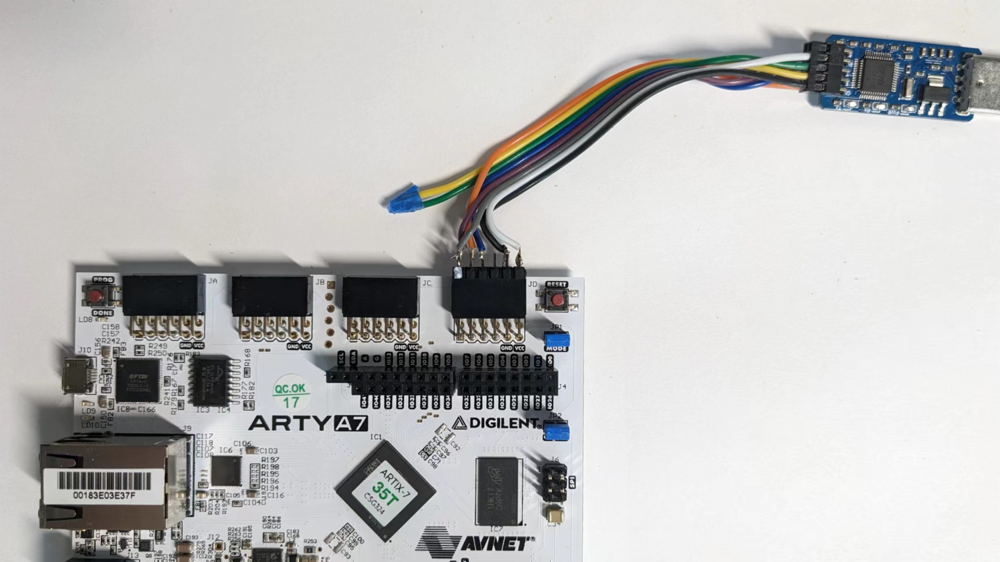
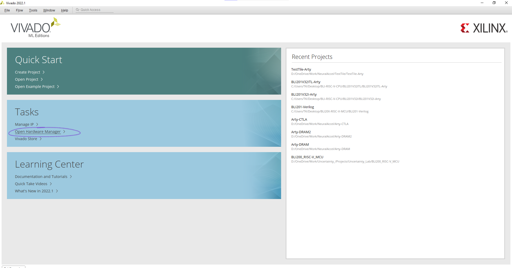
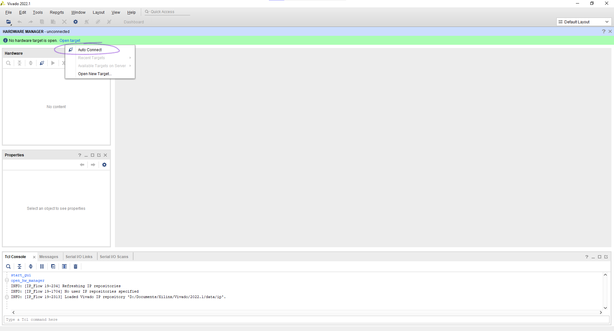
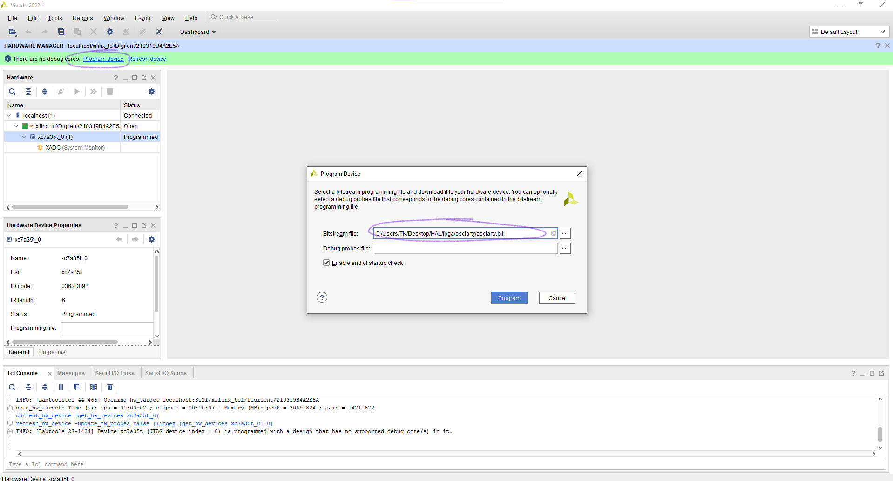

# FPGA Prototyping

## Wiring

Arty JD port

|     |     |       |       |       | square pad |
| --- | --- | ----- | ----- | ----- | ---------- |
| 3V3 | GND | NC    | TCK   | nTRST | TDO        |
| 3V3 | GND | NC    | nRST  | TMS   | TDI        |

Note: `nTRST` is JTAG reset, `nRST` is system reset. For a minimal set up, the two reset lines do not need to be connected.



## Software Setup

1. Download `osciarty.bit`

2. Open vivado, open hardware manager



3. Click "Open target" -> "Auto Connect"



4. Click "Program device", then select the downloaded bitstream and click "Program"



5. 

##### Windows

Open PowerShell in the folder, enter

```bash
cd ./jtag/
openocd.exe -f .\osciarty.cfg
```

And in another PowerShell terminal, enter

```bash
riscv64-unknown-elf-gdb.exe
```

It should prompt the following message

```bash
PS C:\Users\TK\Desktop\HAL\jtag> riscv64-unknown-elf-gdb.exe
D:\Documents\RISCV\riscv64-unknown-elf-toolchain-10.2.0-2020.12.8-x86_64-w64-mingw32\bin\riscv64-unknown-elf-gdb.exe: warning: Couldn't determine a path for the index cache directory.
GNU gdb (SiFive GDB-Metal 10.1.0-2020.12.7) 10.1
Copyright (C) 2020 Free Software Foundation, Inc.
License GPLv3+: GNU GPL version 3 or later <http://gnu.org/licenses/gpl.html>
This is free software: you are free to change and redistribute it.
There is NO WARRANTY, to the extent permitted by law.
Type "show copying" and "show warranty" for details.
This GDB was configured as "--host=x86_64-w64-mingw32 --target=riscv64-unknown-elf".
Type "show configuration" for configuration details.
For bug reporting instructions, please see:
<https://github.com/sifive/freedom-tools/issues>.
Find the GDB manual and other documentation resources online at:
<http://www.gnu.org/software/gdb/documentation/>.
For help, type "help".
Type "apropos word" to search for commands related to "word".
(gdb)
```

Then, enter `target remote localhost:3333`

```bash
(gdb) target remote localhost:3333
Remote debugging using localhost:3333
warning: No executable has been specified and target does not support
determining executable automatically.  Try using the "file" command.
0x00010040 in ?? ()
(gdb)     
```
